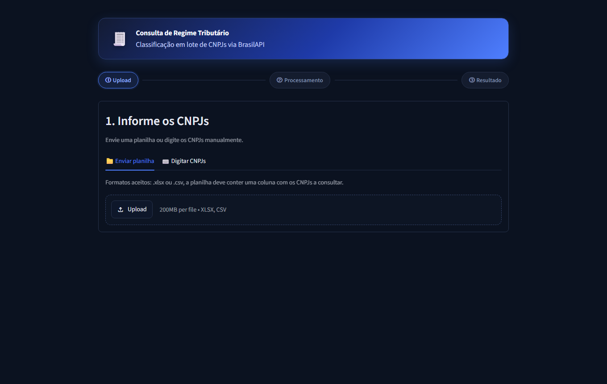
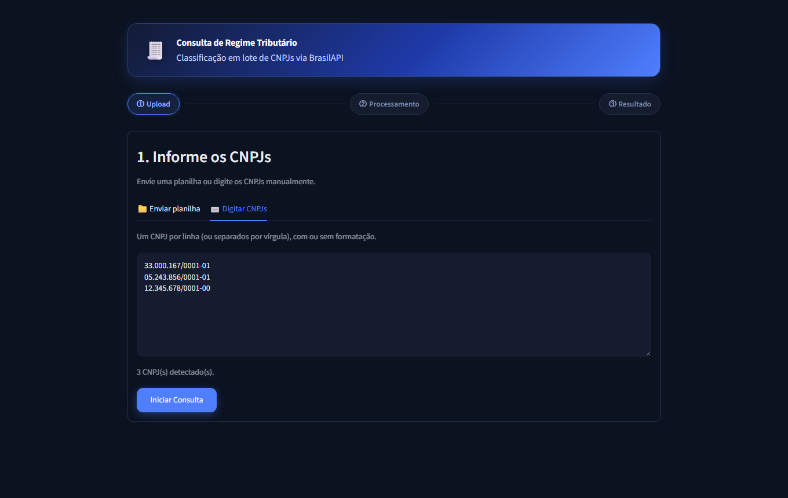
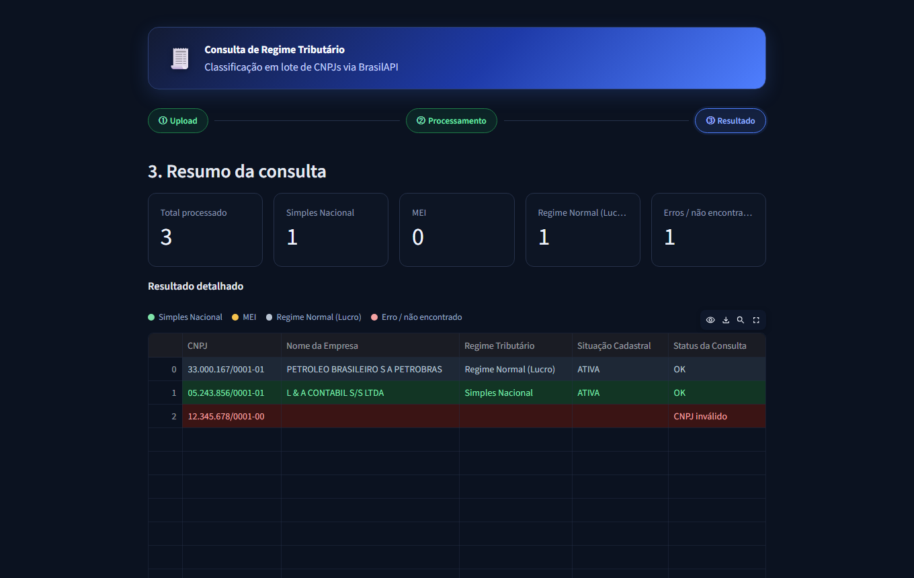

# Consulta de Regime Tributário em Lote

Aplicativo para consultar em lote o regime tributário (Simples Nacional, MEI
ou Regime Normal/Lucro) de uma lista de CNPJs, a partir de uma planilha Excel/CSV
ou digitados manualmente, usando a [BrasilAPI](https://brasilapi.com.br/) (com
[CNPJ.ws](https://cnpj.ws/) como fonte de reforço). Suporta tanto CNPJs
numéricos quanto o novo formato alfanumérico da Receita Federal.

Interface construída em Streamlit, disponível como site (Streamlit Community
Cloud) e também empacotável como aplicativo desktop nativo (janela própria,
sem navegador nem terminal) usando `pywebview` + PyInstaller.

## Capturas de tela

**Informar os CNPJs**: por planilha ou digitando manualmente:




**Resultado**: tabela filtrável/ordenável colorida por regime, com legenda:



## Estrutura do projeto

```
main.py                 Ponto de entrada do app desktop (sobe o servidor e abre a janela)
app.py                  Interface Streamlit
src/
  config.py                Configurações (lê variáveis de ambiente / .env, com valores padrão)
  cnpj_utils.py          Limpeza, validação (dígito verificador) e formatação de CNPJ
  api_client.py           Cliente HTTP da BrasilAPI, com retry/backoff
  classifier.py            Regra de negócio de classificação do regime
  processor.py             Orquestração do lote (threads + progresso)
  excel_io.py               Leitura do upload e geração do Excel de resultado
.streamlit/config.toml   Tema visual (cores, tipografia)
assets/style.css          CSS customizado (cabeçalho, cards, badges)
assets/icon.ico            Ícone do executável/janela
assets/screenshots/         Capturas de tela usadas neste README
build.spec                Configuração do PyInstaller
.env.example               Modelo de configuração opcional (copie para .env para customizar)
requirements.txt          Dependências da interface (usado também pelo Streamlit Community Cloud)
requirements-desktop.txt   Dependências extras só para rodar/empacotar a versão desktop (pywebview, PyInstaller)
```

## Configuração (opcional)

O app funciona com valores padrão, sem nenhuma configuração adicional. Para
customizar limites de requisição, timeouts ou as URLs das APIs, copie
`.env.example` para `.env` e ajuste os valores, veja os comentários no
próprio arquivo. Nada nele é obrigatório nem contém segredo algum, as APIs
usadas (BrasilAPI e CNPJ.ws) são públicas e não exigem chave de acesso.

## Rodando em modo desenvolvimento (desktop)

```powershell
py -m venv .venv
.venv\Scripts\pip install -r requirements-desktop.txt
.venv\Scripts\python main.py
```

Isso abre a janela do aplicativo diretamente. Para depurar a interface no
navegador (com auto-reload), rode o Streamlit puro em vez do launcher:

```powershell
.venv\Scripts\streamlit run app.py
```

## Gerando o executável (.exe)

```powershell
.venv\Scripts\pip install -r requirements-desktop.txt
.venv\Scripts\python -m PyInstaller build.spec --noconfirm
```

O resultado fica em `dist\RegimeTributario\`, uma pasta completa (modo
`--onedir`) contendo `RegimeTributario.exe` e todas as dependências. Essa
pasta inteira é o que deve ser distribuída/copiada para a máquina de cada
colaborador; o `.exe` não funciona sozinho, fora da pasta.

Para distribuir, compacte a pasta `dist\RegimeTributario` (ou embrulhe num
instalador, ex: Inno Setup) e envie para os colaboradores. Um atalho para
`RegimeTributario.exe` pode ser criado na área de trabalho ou no menu iniciar.

**Observação:** o pacote gerado tem ~230MB (inclui o runtime Python e todas
as bibliotecas). Isso é esperado para apps empacotados com PyInstaller.

## Uso

1. Abra o aplicativo (pelo atalho, no caso do desktop, ou pelo link do site).
2. Na aba "Enviar planilha", envie um `.xlsx`/`.csv` e confirme (ou selecione
   manualmente) qual coluna contém os CNPJs — ou use a aba "Digitar CNPJs"
   para colar/digitar a lista diretamente, sem planilha.
3. Clique em "Iniciar Consulta" e acompanhe a barra de progresso.
4. Veja o resumo por regime tributário na tabela colorida (filtrável e
   ordenável, com legenda) e baixe a planilha de resultados formatada.

CNPJs mal formatados, inválidos, não encontrados na Receita ou com falha de
conexão são marcados na respectiva linha ("CNPJ inválido", "CNPJ não
encontrado" ou "Erro na consulta") sem interromper o processamento do lote.

## Atualizando o app nos computadores do escritório

Como cada colaborador tem uma cópia local instalada, atualizações de código
exigem gerar um novo build (`PyInstaller build.spec`) e redistribuir a pasta
`dist\RegimeTributario` novamente para cada máquina.

## Deploy na nuvem (Streamlit Community Cloud)

A interface (`app.py`) também roda como site, sem precisar do launcher
desktop (`main.py`, que depende de `pywebview` e só funciona localmente).
No Streamlit Community Cloud, ao criar o app, configure:

- **Main file path:** `app.py`
- Dependências: o serviço já lê o `requirements.txt` da raiz automaticamente
  (não usa o `requirements-desktop.txt`).
